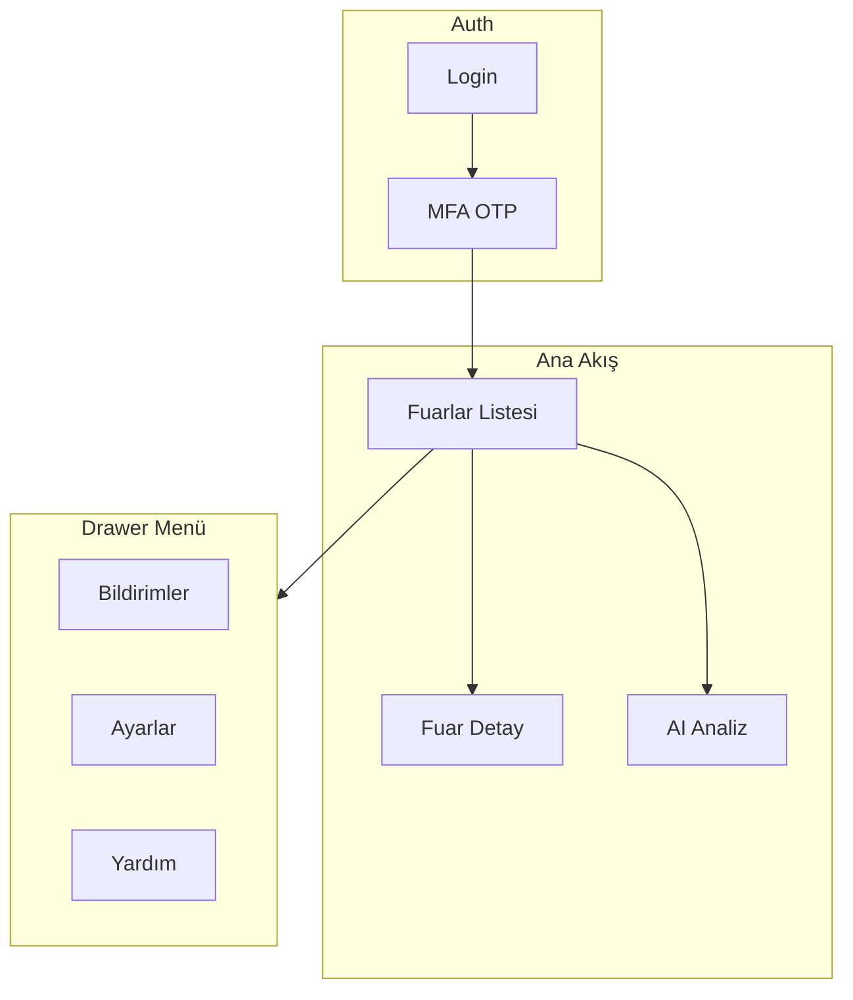

Phase 4 — Mobil Uygulama
========================

Bu doküman, Phase 3 tamamlandıktan sonra uygulanacak mobil uygulama
özelliklerini detaylandırır.

Ön koşul: Phase 3 (Fırsat Takibi, Pipeline & Raporlama) tamamlanmış olmalıdır.
Admin rolüne ait sayfalar (Kullanıcı Yönetimi, Ekipler, Ürün Listesi, Sistem Ayarları,
İşlem Geçmişi) mobil kapsam dışındadır; yalnızca web panelinde kalacaktır.

Phase 4, web uygulamasındaki tüm kullanıcı odaklı fonksiyonları mobil platforma
taşır. Tasarım anlayışı (glassmorphism, koyu tema, mor-turkuaz gradient) web ile
birebir aynı olacaktır.

==============================
DEĞİŞİKLİĞİN ÖZETİ
==============================

Mevcut Durum (As-Is):
- Mobil uygulama mevcut değil (apps/mobile klasörü boş veya yok).
- Tüm CRM işlemleri yalnızca web panelinden yapılabiliyor.
- Fuarda sahada çalışan satış ekibi web erişimi olmadan fırsat girişi yapamıyor.

Hedef Durum (To-Be):
- React Native + Expo ile iOS ve Android uygulaması.
- Fuarlar listesi, fuar detayı, fırsat/müşteri CRUD mobilde tam işlevsel.
- Login, MFA OTP, AI Analiz (Chat) mobilde mevcut.
- Drawer menü: Bildirimler, Ayarlar, Yardım.
- Bottom tab bar: Fuarlar | Yeni Ekle (FAB) | AI Analiz.
- Formlar bottom sheet pattern ile; tasarım web ile aynı.

Neden:
Fuarlarda sahada çalışan satış ekibinin mobil cihazlardan fırsat girişi,
müşteri ekleme, pipeline takibi ve AI analiz erişimi yapabilmesi için
mobil uygulama gereklidir. Admin işlemleri masa başında web panelinden
yapılacağı için mobilde admin sayfaları yoktur.

==============================
GELİŞTİRME YAKLAŞIMI: DİKEY DİLİM (VERTICAL SLICE)
==============================

Bu faz, Phase 3 ile aynı dikey dilim yaklaşımıyla geliştirilir:

Her branch kendi içinde tamamen bitirilir, uçtan uca test edilir ve
main'e merge edilir. Ardından bir sonraki branch'a geçilir.

- Mobil uygulama yalnızca mevcut API'yi tüketir; backend değişikliği yok.
- Veritabanı migration'ı yok; tüm veri API üzerinden gelir.
- Her branch merge öncesi: build, lint, mobil cihaz/simülatörde test.

Toplam: 22 feature (M1–M22), 6 branch.

==============================
ETKİLENEN DOSYALAR (TAM LİSTE)
==============================

YENİ — apps/mobile/ (tümü yeni oluşturulacak):

  app/
    _layout.tsx                 # Root layout, Drawer
    index.tsx                   # Redirect
    (auth)/
      login.tsx                 # Login + MFA
    (tabs)/
      _layout.tsx               # Bottom tab bar
      fairs/
        index.tsx               # Fuarlar listesi
        [id].tsx                # Fuar detay
      chat.tsx                  # AI Analiz

  components/
    ui/
      Button.tsx
      Input.tsx
      Badge.tsx
      BottomSheet.tsx
    fair/
      FairCard.tsx
      FairForm.tsx
    opportunity/
      OpportunityCard.tsx
      OpportunityForm.tsx
      StageTransitionSheet.tsx
    customer/
      CustomerForm.tsx
      CustomerSelectInput.tsx
    layout/
      Header.tsx
      TabBar.tsx
      DrawerContent.tsx
    chat/
      ChatPanel.tsx

  hooks/
    use-fairs.ts
    use-opportunities.ts
    use-customers.ts
    use-auth.ts
    use-chat.ts
    (diğerleri)

  lib/
    api.ts
    query-keys.ts

  stores/
    auth-store.ts

  constants/
    theme.ts

  app.json
  package.json
  tailwind.config.js
  tsconfig.json

DEĞİŞECEK — monorepo root:
  package.json                 # workspaces'a apps/mobile eklenir (zaten apps/* var)
  docs/deployment-and-env-strategy.md  # EXPO_PUBLIC_API_URL, CORS

Shared Package (packages/shared):
  Değişiklik yok; mevcut tipler, şemalar, sabitler kullanılır.
  Gerekirse: api-client factory (baseURL parametreli) eklenebilir.

==============================
MOBİL NAVİGASYON YAPISI
==============================

Bottom Tab Bar:
  - Fuarlar (ev ikonu)
  - Yeni Ekle (ortada FAB, mor-turkuaz gradient) — context-aware
  - AI Analiz (grafik ikonu)

Drawer (hamburger menü):
  - Kullanıcı bilgisi (avatar, isim, rol)
  - Bildirimler (badge)
  - Ayarlar (kullanıcı profil, tema)
  - Yardım

Admin sayfaları mobilde YOK.

==============================
TASARIM SİSTEMİ
==============================

Web ile birebir: docs/design-system.md ve docs/Mobil-ui-examples/ referans.

- Koyu tema, glassmorphism, mor-turkuaz gradient (from-violet-500 to-cyan-500)
- NativeWind v4 ile TailwindCSS token'ları
- Font: Playfair Display (başlıklar), DM Sans (gövde)
- Kartlar: rounded-2xl, glass arka plan, border-white/20
- Formlar: bottom sheet pattern (aşağıdan yukarı açılan modal)

Tasarım tutarlılığı (efektler, animasyonlar):
- Web ile mobil aynı görsellikte olmalı: Eş zamanlı geliştirme tercih edilir.
- Her yeni feature’da web bileşenini referans alın ve mobilde aynı stili uygulayın.
- Mevcut farklar için: "Phase 4 polish" veya Branch 6 (M20-M22) içinde toplu gözden geçirme yapılabilir.

==============================
BRANCH YÖNETİMİ STRATEJİSİ
==============================

6 branch, her biri bağımsız dikey dilim:

  Branch                              Feature'lar   Bağımlılık
  ──────────────────────────────────  ────────────  ──────────────
  feature/M1-M5-mobil-altyapi         M1–M5         Yok
  feature/M6-M10-auth-fuarlar         M6–M10        Branch 1
  feature/M11-M15-firsat-pipeline     M11–M15       Branch 2
  feature/M16-M18-kartvizit-notlar   M16–M18       Branch 3
  feature/M19-ai-analiz               M19           Branch 1
  feature/M20-M22-drawer-final        M20–M22       Branch 2, 3, 4, 5

Zorunlu uygulama sırası:

  1. Branch 1 (Mobil Altyapı)     → main'e merge
     Expo, NativeWind, API client, auth store, UI, layout

  2. Branch 2 (Auth & Fuarlar)     → main'e merge
     Login, MFA, Fuarlar listesi, Fuar CRUD, Fuar detay, Toolbar

  3. Branch 3 (Fırsat & Pipeline)  → main'e merge
     Fırsat kartı, formlar, pipeline geçiş, teklif

  4. Branch 4 (Kartvizit, Notlar)  → main'e merge
     Kartvizit upload/OCR, notlar, etiketler

  5. Branch 5 (AI Analiz)         → main'e merge
     Chat sayfası

  6. Branch 6 (Drawer & Final)     → main'e merge
     Drawer, Bildirimler, Ayarlar, Yardım, boş durumlar, entegrasyon

Her branch merge öncesi zorunlu kontroller:
  [ ] npm run build -w packages/shared — hatasız
  [ ] npm run build -w apps/api — hatasız
  [ ] npm run build -w apps/web — hatasız
  [ ] npm run build -w apps/mobile — hatasız (veya expo prebuild)
  [ ] Mobil simülatör/cihazda uçtan uca test edildi

Git Workflow (git-conventions.mdc ile uyumlu):
  Phase 4 branch'leri M{n} prefix kullanır (phase-4-mobil.md feature numaraları).

  Branch oluşturma:
    git checkout main
    git pull origin main
    git checkout -b feature/M1-M5-mobil-altyapi

  Geliştirme sırasında (granüler commit):
    git add .
    git commit -m "feat(mobile): add Expo project with NativeWind"
    git commit -m "feat(mobile): add API client and auth store"

  Merge (tüm kontroller geçtikten sonra):
    git checkout main
    git merge feature/M1-M5-mobil-altyapi
    git branch -d feature/M1-M5-mobil-altyapi

  Commit scope: mobile (apps/mobile için)

==============================
FEATURE LİSTESİ (M1 — M22)
==============================

Her feature tamamlandığında Durum alanı [x] olarak işaretlenir.

╔══════════════════════════════════════════════════════════╗
║  BRANCH 1: MOBİL ALTYAPI                                 ║
║  Branch: feature/M1-M5-mobil-altyapi                     ║
║  Bağımlılık: Yok                                         ║
╚══════════════════════════════════════════════════════════╝

----------------------------------------------------------------------
M1 — Expo Proje Kurulumu & NativeWind
----------------------------------------------------------------------

Amaç: apps/mobile klasöründe React Native + Expo (SDK 52+) projesi oluşturmak,
NativeWind v4 ile TailwindCSS kullanmak.

Yapılacaklar:

1. npx create-expo-app@latest apps/mobile --template tabs (veya blank)
2. TypeScript strict mode, @crm/shared workspace bağımlılığı
3. NativeWind v4 kurulumu (tailwind.config.js, babel.config.js)
4. Expo Router kurulumu (file-based routing)
5. app.json, package.json yapılandırması
6. EXPO_PUBLIC_API_URL ortam değişkeni (.env)

Etkilenen dosyalar:
  YENİ: apps/mobile/ (tüm proje iskeleti)

Commit: feat(mobile): add Expo project with NativeWind and Expo Router

Durum: [x]

----------------------------------------------------------------------
M2 — API Client & Auth Store
----------------------------------------------------------------------

Amaç: Axios instance, token yönetimi, auth store (Zustand), secure storage.

Yapılacaklar:

1. lib/api.ts: Axios instance, baseURL (EXPO_PUBLIC_API_URL), interceptors
2. Access token: Authorization header, 401'de refresh denemesi
3. expo-secure-store: refresh token güvenli saklama
4. stores/auth-store.ts: login, logout, refresh, verifyMfa, user state
5. @crm/shared tiplerini ve API endpoint sabitlerini kullan

Etkilenen dosyalar:
  YENİ: lib/api.ts, stores/auth-store.ts

Commit: feat(mobile): add API client and auth store

Durum: [x]

----------------------------------------------------------------------
M3 — Tasarım Token'ları & Temel UI Bileşenleri
----------------------------------------------------------------------

Amaç: design-system.md ile uyumlu Button, Input, Badge, BottomSheet.

Yapılacaklar:

1. constants/theme.ts: renk token'ları (bg, accent, glass, border)
2. components/ui/Button.tsx: primary (gradient), secondary (glass)
3. components/ui/Input.tsx: label, placeholder, glass stil
4. components/ui/Badge.tsx: renk prop, rounded-full
5. components/ui/BottomSheet.tsx: @gorhom/bottom-sheet veya benzeri, sürükleme çubuğu

Etkilenen dosyalar:
  YENİ: constants/theme.ts, components/ui/*.tsx

Commit: feat(mobile): add design tokens and base UI components

Durum: [x]

----------------------------------------------------------------------
M4 — Layout: Header, TabBar, Drawer
----------------------------------------------------------------------

Amaç: Root layout, Drawer navigasyon, Bottom Tab Bar.

Yapılacaklar:

1. app/_layout.tsx: Drawer navigator, SafeAreaProvider
2. components/layout/Header.tsx: hamburger, logo, arama ikonu
3. components/layout/DrawerContent.tsx: kullanıcı bilgisi, Bildirimler, Ayarlar, Yardım
4. app/(tabs)/_layout.tsx: 3 sekme (Fuarlar, FAB, AI Analiz)
5. FAB ortada, mor-turkuaz gradient

Etkilenen dosyalar:
  YENİ: app/_layout.tsx, app/(tabs)/_layout.tsx, components/layout/*.tsx

Commit: feat(mobile): add Header, TabBar, Drawer layout

Durum: [x]

----------------------------------------------------------------------
M5 — Protected Route & Auth Redirect
----------------------------------------------------------------------

Amaç: Giriş yapmamış kullanıcıyı login'e yönlendirmek.

Yapılacaklar:

1. app/(auth)/login.tsx: Login sayfası route'u
2. Root layout: auth state kontrolü, redirect logic
3. Token yoksa veya geçersizse → login
4. app/index.tsx: auth varsa tabs'a, yoksa login'e redirect

Etkilenen dosyalar:
  YENİ: app/(auth)/login.tsx, app/index.tsx
  DEĞİŞEN: app/_layout.tsx

Commit: feat(mobile): add protected route and auth redirect

Durum: [x]

╔══════════════════════════════════════════════════════════╗
║  BRANCH 2: AUTH & FUARLAR                                ║
║  Branch: feature/M6-M10-auth-fuarlar                      ║
║  Bağımlılık: Branch 1                                     ║
╚══════════════════════════════════════════════════════════╝

----------------------------------------------------------------------
M6 — Login Sayfası & MFA OTP
----------------------------------------------------------------------

Amaç: E-posta, parola, MFA 2 aşamalı akış (web ile aynı).

Yapılacaklar:

1. Login formu: email, password, React Hook Form + Zod
2. requiresMfa response → OTP ekranına geçiş
3. MfaCodeInput benzeri 6 haneli OTP girişi
4. verifyMfa API çağrısı, başarıda tabs'a yönlendirme
5. Hata mesajları Türkçe (error-handling.mdc)

Etkilenen dosyalar:
  YENİ: app/(auth)/login.tsx (tam implementasyon)
  DEĞİŞEN: stores/auth-store.ts (verifyMfa zaten olabilir)

Commit: feat(mobile): implement login and MFA flow

Durum: [x]

----------------------------------------------------------------------
M7 — Fuarlar Listesi
----------------------------------------------------------------------

Amaç: Fuar kartları grid, özet satırı, arama, empty state.

Yapılacaklar:

1. app/(tabs)/fairs/index.tsx: useFairs hook, FlatList/ScrollView
2. components/fair/FairCard.tsx: fuar adı, konum, tarih, fırsat sayısı badge
3. Özet: "X fuar · Y toplam fırsat"
4. Header'da arama ikonu (opsiyonel fuar listesi araması)
5. Empty state: emoji, başlık, açıklama, "Yeni Fuar Ekle" CTA

Etkilenen dosyalar:
  YENİ: app/(tabs)/fairs/index.tsx, components/fair/FairCard.tsx
  YENİ: hooks/use-fairs.ts, lib/query-keys.ts

Commit: feat(mobile): add fairs list with FairCard

Durum: [x]

----------------------------------------------------------------------
M8 — Fuar CRUD (Bottom Sheet)
----------------------------------------------------------------------

Amaç: Yeni Fuar Ekle, Fuar Düzenle, Fuar Sil.

Yapılacaklar:

1. components/fair/FairForm.tsx: Fuar Adı, Konum, Başlangıç, Bitiş (date picker)
2. Bottom sheet ile form gösterimi
3. FAB veya empty state CTA → Yeni Fuar bottom sheet açılır
4. createFairSchema, updateFairSchema (@crm/shared) kullan
5. Fuar düzenleme: FairCard uzun basma veya detay sayfasından
6. Fuar silme: confirm dialog, cascade uyarısı

Etkilenen dosyalar:
  YENİ: components/fair/FairForm.tsx
  DEĞİŞEN: app/(tabs)/fairs/index.tsx, FairCard.tsx

Commit: feat(mobile): add Fair CRUD with bottom sheet form

Durum: [x]

----------------------------------------------------------------------
M9 — Fuar Detay Sayfası
----------------------------------------------------------------------

Amaç: Fuar bilgileri, özet kartları, geri dönüş.

Yapılacaklar:

1. app/(tabs)/fairs/[id].tsx: useFair(id) veya useFairDetail
2. Header: "← Fuarlara Dön", fuar adı, konum, tarih
3. Özet kartları: Toplam Fırsat, dönüşüm bazlı (Çok yaklaş, Yaklaş, vb.)
4. Sağ üst: Düzenle, Sil butonları

Etkilenen dosyalar:
  YENİ: app/(tabs)/fairs/[id].tsx
  DEĞİŞEN: hooks/use-fairs.ts

Commit: feat(mobile): add fair detail page with stats

Durum: [x]

----------------------------------------------------------------------
M10 — Toolbar: Arama & Filtreler
----------------------------------------------------------------------

Amaç: Fuar detayda fırsat araması, dönüşüm ve aşama filtreleri.

Yapılacaklar:

1. Arama input: "İsim veya Firma ara...", gerçek zamanlı
2. Dönüşüm filtresi: "Tüm Dönüşümler" + 5 seçenek
3. Aşama filtresi: "Tüm Aşamalar" + pipeline aşamaları
4. Müşteri Ekle / Fırsat Ekle butonu (toolbar'da)

Etkilenen dosyalar:
  YENİ: components/fair/OpportunityToolbar.tsx (veya inline)
  DEĞİŞEN: app/(tabs)/fairs/[id].tsx

Commit: feat(mobile): add search and filters to fair detail

Durum: [x]

╔══════════════════════════════════════════════════════════╗
║  BRANCH 3: FIRSAT & PİPELİNE                             ║
║  Branch: feature/M11-M15-firsat-pipeline                  ║
║  Bağımlılık: Branch 2                                    ║
╚══════════════════════════════════════════════════════════╝

----------------------------------------------------------------------
M11 — Fırsat Kartı (Accordion)
----------------------------------------------------------------------

Amaç: Fırsat listesi, accordion açılır/kapanır kart.

Yapılacaklar:

1. components/opportunity/OpportunityCard.tsx
2. Kapalı: müşteri adı, firma, badge'ler (dönüşüm, ürün, etiket), kartvizit ikonu
3. Açık: bütçe, iletişim, ürün tonajı, notlar, pipeline, teklif indirme, Düzenle/Sil
4. Tıklama ile aç/kapat animasyonu

Etkilenen dosyalar:
  YENİ: components/opportunity/OpportunityCard.tsx
  YENİ: hooks/use-opportunities.ts

Commit: feat(mobile): add OpportunityCard with accordion

Durum: [x]

----------------------------------------------------------------------
M12 — Fırsat Formu (Bottom Sheet)
----------------------------------------------------------------------

Amaç: Yeni fırsat ekleme, fırsat düzenleme.

Yapılacaklar:

1. components/opportunity/OpportunityForm.tsx
2. Müşteri seçimi (CustomerSelectInput), bütçe, dönüşüm, ürün+tonaj, etiketler
3. createOpportunitySchema, updateOpportunitySchema (@crm/shared)
4. Bottom sheet ile gösterim

Etkilenen dosyalar:
  YENİ: components/opportunity/OpportunityForm.tsx
  YENİ: components/customer/CustomerSelectInput.tsx (müşteri listesi seçimi)

Commit: feat(mobile): add Opportunity form with bottom sheet

Durum: [x]

----------------------------------------------------------------------
M13 — Müşteri Formu (Bottom Sheet)
----------------------------------------------------------------------

Amaç: Yeni müşteri ekleme, müşteri düzenleme.

Yapılacaklar:

1. components/customer/CustomerForm.tsx
2. Firma, ad, telefon, e-posta, bütçe, dönüşüm, ürünler, kartvizit upload
3. createCustomerSchema, updateCustomerSchema (@crm/shared)
4. Fuar detay toolbar'dan "Müşteri Ekle" ile açılır

Etkilenen dosyalar:
  YENİ: components/customer/CustomerForm.tsx

Commit: feat(mobile): add Customer form with bottom sheet

Durum: [x]

----------------------------------------------------------------------
M14 — Pipeline Geçiş (StageTransitionSheet)
----------------------------------------------------------------------

Amaç: Fırsat aşaması değiştirme, not, kayıp nedeni (olumsuzda).

Yapılacaklar:

1. components/opportunity/StageTransitionSheet.tsx
2. Aşama seçimi (dropdown veya liste)
3. Not alanı (opsiyonel)
4. stage === 'olumsuz' ise lossReason zorunlu
5. stageTransitionSchema (@crm/shared)

Etkilenen dosyalar:
  YENİ: components/opportunity/StageTransitionSheet.tsx
  DEĞİŞEN: OpportunityCard.tsx (aşama değiştir butonu)

Commit: feat(mobile): add pipeline stage transition sheet

Durum: [x]

----------------------------------------------------------------------
M15 — Teklif Oluşturma & İndirme
----------------------------------------------------------------------

Amaç: Teklif aşamasında Word/PDF oluşturma, indirme.

Yapılacaklar:

1. StageTransitionSheet veya ayrı sheet: targetStage === 'teklif' özel UI
2. Format seçimi (Word/PDF), ürün fiyat listesi
3. POST /opportunities/:id/create-offer API çağrısı
4. GET /opportunities/:id/offer-document ile blob indirme
5. expo-file-system + expo-sharing ile dosya paylaşımı

Etkilenen dosyalar:
  DEĞİŞEN: StageTransitionSheet.tsx
  YENİ: hooks/use-offer.ts

Commit: feat(mobile): add offer creation and download

Durum: [x]

╔══════════════════════════════════════════════════════════╗
║  BRANCH 4: KARTVİZİT, NOTLAR, ETİKETLER                  ║
║  Branch: feature/M16-M18-kartvizit-notlar                ║
║  Bağımlılık: Branch 3                                    ║
╚══════════════════════════════════════════════════════════╝

----------------------------------------------------------------------
M16 — Kartvizit Upload & Kart Vizit Tara (OCR)
----------------------------------------------------------------------

Amaç: Müşteri formunda kartvizit fotoğrafı, OCR ile form doldurma.

Yapılacaklar:

1. CustomerForm: kartvizit upload alanı (expo-image-picker)
2. POST /upload/card-image ile yükleme
3. "Kart Vizit Tara" butonu: kamera/galeri → OCR (react-native-tesseract-ocr veya benzeri)
4. parse-business-card (@crm/shared) ile metin parse, form alanlarına doldurma

Etkilenen dosyalar:
  DEĞİŞEN: CustomerForm.tsx, CustomerSelectInput.tsx
  YENİ: hooks/use-business-card-ocr.ts (mobil uyarlaması)

Commit: feat(mobile): add card image upload and OCR

Durum: [ ]

----------------------------------------------------------------------
M17 — Fırsat Notları
----------------------------------------------------------------------

Amaç: Fırsata not ekleme, not listesi görüntüleme.

Yapılacaklar:

1. OpportunityCard genişletilmiş: notlar bölümü
2. Not ekleme: text input + gönder, POST /opportunities/:id/notes
3. Not listesi: GET ile çekme, tarih sıralı

Etkilenen dosyalar:
  DEĞİŞEN: OpportunityCard.tsx
  YENİ: hooks/use-opportunity-notes.ts

Commit: feat(mobile): add opportunity notes

Durum: [ ]

----------------------------------------------------------------------
M18 — Etiketler UI
----------------------------------------------------------------------

Amaç: Fırsata etiket atama, etiket filtreleme.

Yapılacaklar:

1. OpportunityForm: etiket seçimi (mevcut etiketler listesi, admin web'de yönetir)
2. OpportunityCard: etiket badge'leri
3. Fuar detay toolbar: etiket filtresi (dropdown)

Etkilenen dosyalar:
  DEĞİŞEN: OpportunityForm.tsx, OpportunityCard.tsx
  YENİ: hooks/use-tags.ts

Commit: feat(mobile): add tags UI and filter

Durum: [ ]

╔══════════════════════════════════════════════════════════╗
║  BRANCH 5: AI ANALİZ                                     ║
║  Branch: feature/M19-ai-analiz                            ║
║  Bağımlılık: Branch 1                                     ║
╚══════════════════════════════════════════════════════════╝

----------------------------------------------------------------------
M19 — AI Analiz (Chat) Sayfası
----------------------------------------------------------------------

Amaç: Web'deki ChatPanel ile aynı işlevsellik.

Yapılacaklar:

1. app/(tabs)/chat.tsx: Chat sayfası
2. components/chat/ChatPanel.tsx: mesaj listesi, input, API entegrasyonu
3. Chat API endpoint'leri (web ile aynı) kullanımı

Etkilenen dosyalar:
  YENİ: app/(tabs)/chat.tsx, components/chat/ChatPanel.tsx
  YENİ: hooks/use-chat.ts

Commit: feat(mobile): add AI Analiz chat page

Durum: [ ]

╔══════════════════════════════════════════════════════════╗
║  BRANCH 6: DRAWER & FİNAL                               ║
║  Branch: feature/M20-M22-drawer-final                     ║
║  Bağımlılık: Branch 2, 3, 4, 5                           ║
╚══════════════════════════════════════════════════════════╝

----------------------------------------------------------------------
M20 — Drawer: Bildirimler, Ayarlar, Yardım
----------------------------------------------------------------------

Amaç: Drawer menü öğelerinin tam işlevselliği.

Yapılacaklar:

1. Bildirimler: liste (API varsa), okunmamış badge
2. Ayarlar: kullanıcı profil bilgisi, çıkış
3. Yardım: SSS, iletişim (statik sayfa veya link)

Etkilenen dosyalar:
  DEĞİŞEN: DrawerContent.tsx
  YENİ: app/(drawer)/notifications.tsx, settings.tsx, help.tsx (veya modal/sheet)

Commit: feat(mobile): implement drawer menu items

Durum: [ ]

----------------------------------------------------------------------
M21 — Boş Durumlar & Hata Yönetimi
----------------------------------------------------------------------

Amaç: Empty state, loading, network error kullanıcı deneyimi.

Yapılacaklar:

1. Fuarlar empty state, müşteri empty state, arama sonuçsuz
2. Loading spinner/skeleton
3. Network error: "Sunucuya bağlanılamıyor" + retry
4. 401: token refresh, başarısızsa login'e yönlendirme

Etkilenen dosyalar:
  DEĞİŞEN: ilgili sayfa ve bileşenler, lib/api.ts

Commit: feat(mobile): add empty states and error handling

Durum: [ ]

----------------------------------------------------------------------
M22 — Entegrasyon Testi & Son Düzenlemeler
----------------------------------------------------------------------

Amaç: Uçtan uca akış doğrulama, edge case'ler.

Yapılacaklar:

1. Login → Fuarlar → Fuar Detay → Fırsat Ekle → Düzenle → Sil akışı
2. MFA akışı testi
3. Offline/network kesintisi simülasyonu
4. Uzun metin, özel karakterler edge case'leri
5. Safe area, farklı ekran boyutları kontrolü

Etkilenen dosyalar:
  Genel doğrulama, gerekirse küçük düzeltmeler

Commit: chore(mobile): integration test and final adjustments

Durum: [ ]

==============================
ÖZET — İŞ SIRASI
==============================

Branch 1: Mobil Altyapı
  M1 → Expo, NativeWind, Expo Router
  M2 → API client, auth store
  M3 → UI bileşenleri
  M4 → Layout (Header, TabBar, Drawer)
  M5 → Protected route

Branch 2: Auth & Fuarlar
  M6 → Login, MFA
  M7 → Fuarlar listesi
  M8 → Fuar CRUD
  M9 → Fuar detay
  M10 → Toolbar (arama, filtreler)

Branch 3: Fırsat & Pipeline
  M11 → Fırsat kartı
  M12 → Fırsat formu
  M13 → Müşteri formu
  M14 → Pipeline geçiş
  M15 → Teklif oluşturma/indirme

Branch 4: Kartvizit, Notlar, Etiketler
  M16 → Kartvizit upload, OCR
  M17 → Notlar
  M18 → Etiketler

Branch 5: AI Analiz
  M19 → Chat sayfası

Branch 6: Drawer & Final
  M20 → Drawer menü öğeleri
  M21 → Boş durumlar, hata yönetimi
  M22 → Entegrasyon testi

Toplam: 22 feature, 6 branch
Admin sayfaları: 0 (sadece web)

==============================
ÖNEMLİ NOTLAR
==============================

- Admin işlemleri (Kullanıcı Yönetimi, Ekipler, Ürün Listesi, Sistem Ayarları,
  İşlem Geçmişi) yalnızca web panelinde yapılır. Mobilde bu sayfalar yoktur.
- Mobil uygulama mevcut API'yi tüketir; backend değişikliği gerektirmez.
- Tasarım docs/design-system.md ve docs/Mobil-ui-examples/ ile uyumlu olmalıdır.
- deployment-and-env-strategy.md güncellenmeli: EXPO_PUBLIC_API_URL, CORS
  (localhost:8081 Expo dev için).

Zorunlu Kurallar (.cursor/rules/ — mobil geliştirmede geçerli):
  - code-standards.mdc: Naming, yapı, TypeScript strict, Tailwind/NativeWind
  - api-design.mdc: REST endpoint kullanımı, response formatı
  - security-rules.mdc: Token storage (expo-secure-store), input validation
  - error-handling.mdc: Hata mesajları Türkçe, kullanıcı dostu geri bildirim
  - git-conventions.mdc: Branch adı (feature/M{n}-...), commit format (feat(mobile):)
  - project-architecture.mdc: Shared package kullanımı, katmanlı yapı
  - tech-stack.md: React Native + Expo, NativeWind v4, TanStack Query, Zustand
