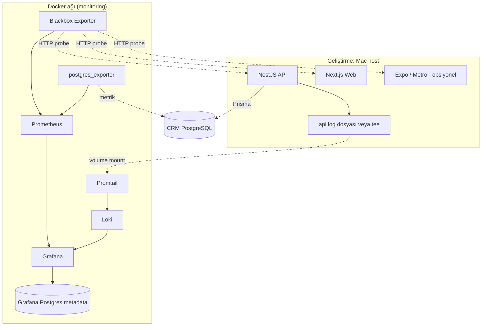

# Faz 8 — Gözlemlenebilirlik & İzleme (Grafana Stack)

Bu doküman, **Fuar CRM** için kurumsal düzeyde **gözlemlenebilirlik (observability)** hedeflerini, **mimari kararları**, **Docker tabanlı yerel geliştirme** ve **üretim** senaryolarını, **uyarı (alert) e-posta formatlarını** ve **Grafana pano tasarımını** tanımlar.  
**Phase 1 feature listesi (`docs/phase-1-features.md`) dışında** çapraz kesen bir fazdır; branch adlandırması `feature/mon8-*` ile yapılır (bkz. §0.2).

**Hedef kitle:** Uygulama geliştiricileri ile birlikte sistemi **profesyonel bir monitoring / SRE / NOC ekibinin** standartlarına uygun şekilde işletmesi (incident triage, kök neden analizi, kapasite planlama, SLA raporlaması).

---

## 0. Proje kuralları ve hizalama

### 0.1 Bu fazın yeri

- CRM **iş veritabanı** (Prisma / PostgreSQL) ile **Grafana metadata veritabanı** farklı amaçlara hizmet eder; **karıştırılmaz** (bkz. §2.3).
- Yeni **ortam değişkenleri** veya DEV/PROD davranış farkları eklendiğinde **`docs/deployment-and-env-strategy.md`** güncellenir (`.cursor/rules/deployment-env-update.mdc`).
- Gizli bilgiler **kodda ve commit edilen dosyalarda tutulmaz**; `.env.monitoring` / `.env.monitoring.example` kalıbı kullanılır (`.cursor/rules/security-rules.mdc`).
- İzleme stack’i **CRM uygulama kod tabanına** (Nest/Next) doğrudan sıkı bağlı olmak zorunda değildir; öncelik **Docker Compose** (veya prod’da eşdeğer orkestrasyon) ile ayrı servislerdir.

### 0.2 Git branch isimlendirmesi

| Kural | Değer |
|--------|--------|
| Önek | `feature/mon8-{iki haneli sıra}-{kisa-aciklama}` |
| Örnek | `feature/mon8-01-compose-prometheus-loki` |

Phase 1 `F{n}` numarası ile karışmayı önlemek için **mon8** kullanılır.

### 0.3 Origin `main` ve remote feature branch politikası (Faz 8 zorunlu)

Bu fazda Git süreci, **tek doğruluk kaynağının `origin/main`** olmasını ve işin **remote’ta izlenebilir** olmasını zorunlu kılar.

| Kural | Açıklama |
|--------|-----------|
| **`origin/main` güncelliği** | Depodaki güncel üretim hattı **`origin/main`** kabul edilir. Merge tamamlandıktan sonra **mutlaka** `git push origin main` çalıştırılır; böylece uzak depo her zaman birleştirilmiş son durumu yansıtır. |
| **Feature branch’ler remote’ta** | `feature/mon8-*` dalları **yalnızca lokalde bırakılmaz**. Branch oluşturulduktan hemen sonra **`git push -u origin feature/mon8-{nn}-kisa-aciklama`** ile `origin` üzerinde kayıt altına alınır; geliştirme boyunca anlamlı commit’ler **push** edilir. |
| **Her Mon8 işine başlamadan önce** | `git fetch origin` → `git checkout main` → `git pull origin main` (veya eşdeğer: `main`’in `origin/main` ile hizalı olduğunun doğrulanması). Çakışma varsa çözülmeden yeni iş başlamaz. |
| **Merge sonrası temizlik** | `main`’e birleştirme ve `origin`’e push tamamlandıktan sonra, feature branch **remote’tan** silinir: `git push origin --delete feature/mon8-{nn}-kisa-aciklama`. İsteğe bağlı: `git branch -d feature/mon8-...` ile lokal silme. *(İş geçmişi commit SHA ile `main`’de kalır.)* |

**Not:** Bu politika, Faz 8 kapsamındaki işler için geçerlidir; global `.cursor/rules/git-conventions.mdc` ile çelişirse **Mon8 işleri için bu bölüm önceliklidir**.

### 0.4 Mon8 iş akışı: Cursor Agent ve geliştirici rolleri

| Aşama | Kim yapar | Ne yapılır |
|--------|-----------|------------|
| **1. Geliştirme öncesi Git** | **Agent** | `git fetch origin`; `main`’i `origin/main` ile hizala (`checkout main`, `pull origin main`); `feature/mon8-{nn}-…` branch’ini oluştur; **ilk commit öncesi veya hemen ardından** `git push -u origin <branch>` ile remote’a al; geliştirme bu branch üzerinde devam eder. |
| **2. Uygulama / dokümantasyon** | **Agent** (veya eş zamanlı pair) | §12 maddeleri, Compose, API health, provisioning vb. |
| **3. Doğrulama** | **Geliştirici** | §13 kontrol listesi, Grafana/probe/log/SMTP davranışı, gözle kontrol. **Merge için açık onay** verilir. |
| **4. Merge ve remote güncelleme** | **Agent** (yalnızca geliştirici onayından sonra) | `main`’e merge (proje standardına uygun: fast-forward veya merge commit); **`git push origin main`**; feature branch için **`git push origin --delete …`**; istenirse lokal branch silinir. |

**Geliştiriciden beklenen komutlar (isteğe bağlı / manuel müdahale):** Agent erişemediğinde aynı sıra elle uygulanır: fetch → main güncelle → branch + push → (onay sonrası) merge → `push origin main` → remote branch delete.

**Özet komut sırası (Agent hedefi):**

```text
# Her Mon8 branch başında
git fetch origin
git checkout main
git pull origin main
git checkout -b feature/mon8-NN-kisa-aciklama
git push -u origin feature/mon8-NN-kisa-aciklama

# … geliştirme, commit, aralıklı git push origin feature/mon8-NN-…

# Geliştirici onayından sonra
git checkout main
git pull origin main
git merge feature/mon8-NN-kisa-aciklama
git push origin main
git push origin --delete feature/mon8-NN-kisa-aciklama
```

### 0.5 Teknik geliştirme adımları (her alt paket için — §12 ile birlikte)

```text
1. §0.4 aşama 1–2 (Git + teknik iş)
2. Yerel doğrulama: stack ayağa kalkar, probe’lar yeşil, test e-postası (§7–8)
3. Build / güvenlik: sırlar repoda yok; örnek env güncel
4. §0.4 aşama 3–4: geliştirici onayı → merge → origin main push → remote branch silme
```

---

## 1. Karar özeti

| Konu | Karar |
|------|--------|
| **Metrik deposu** | **Prometheus** — zaman serisi, **dosya tabanlı TSDB** (container volume). |
| **Log deposu** | **Grafana Loki** — indeks + chunk dosyaları (container volume). |
| **Grafana yapılandırma DB** | **PostgreSQL** — Grafana’nın dahili SQLite’ı yerine **harici Postgres** (kullanıcılar, panolar, klasörler, alert kuralları tanımı, veri kaynağı kayıtları). |
| **Yönetici erişimi** | **Grafana yerleşik kullanıcı modeli** (şifreler Grafana tarafından **hash** ile saklanır; “encrypted reversible secret” değildir). |
| **Uptime / sentetik kontrol** | **Blackbox Exporter** + Prometheus scrape. |
| **Uygulama DB metrikleri** | **postgres_exporter** — CRM’in kullandığı PostgreSQL instance’ı (ayrı bağlantı; salt okunur önerilir). |
| **Log toplama** | **Promtail** → Loki (host’ta çalışan API için log dosyası + volume veya ileride container stdout). |
| **Uyarı bildirimi** | **Grafana Alerting** → **SMTP** (Contact point). İsteğe bağlı: Alertmanager ile yönlendirme (bu dokümanda Grafana SMTP yeterli varsayılır). |
| **Geliştirme ortamı** | Mac: **CRM uygulaması terminalde**; **izleme stack’i Docker** içinde. |
| **Saklama (retention)** | **Dev:** metrik ve log için hedef **~1 saat**. **Prod:** **7 gün** (Prometheus `storage.tsdb.retention.time`, Loki `limits_config` / compactor). |
| **Reverse proxy** | Şu an **yok**; probe’lar doğrudan servis portlarına. Prod’da proxy eklendiğinde hedef URL’ler güncellenir. |

---

## 2. Mimari genel bakış

### 2.1 Mantıksal diyagram



**Not (dev):** Blackbox ve postgres_exporter, host’taki servislere **`host.docker.internal`** üzerinden erişir.

### 2.2 Veri türüne göre saklama yeri

| Veri | Nerede tutulur | Not |
|------|------------------|-----|
| Metrik örnekleri (probe süresi, up/down, PG istatistikleri) | Prometheus TSDB dosyaları | Yüksek kartinalite; SQL’e taşınmaz (bilinçli karar). |
| Ham log satırları | Loki chunk’ları | Arama ve alert için LogQL. |
| Grafana panelleri, klasörler, alert **kural tanımları**, kullanıcı kayıtları | **PostgreSQL (Grafana DB)** | Yedekleme ve HA için uygun. |
| CRM müşteri / fuar / kullanıcı verisi | CRM PostgreSQL | İzleme stack’inde **çoğaltılmaz**. |

### 2.3 İki PostgreSQL rolü (ayırt edici)

| Instance / DB | Rol |
|---------------|-----|
| **CRM PostgreSQL** | Uygulama verisi; `postgres_exporter` buradan **sistem metrikleri** okur. |
| **Grafana PostgreSQL** | Yalnızca Grafana’nın internal tabloları (`user`, `dashboard`, `alert_rule` vb.). |

Prod’da fiziksel olarak **tek sunucuda iki database** veya **iki ayrı instance** olabilir; **mantıksal ayrım** zorunludur.

---

## 3. Bileşen sorumlulukları (SRE perspektifi)

| Bileşen | Sorumluluk | Operasyon notu |
|---------|------------|----------------|
| **Grafana** | Görselleştirme, kimlik doğrulama, alert değerlendirme, bildirim | Admin hesabı ve SMTP **env** ile; sürüm pin’leme önerilir. |
| **Prometheus** | Metrik toplama ve saklama, alert kuralı değerlendirme (Grafana unified alerting ile birlikte veya klasik; tercih dokümante) | Retention ve disk kota izlenir. |
| **Loki** | Log depolama, sorgu API’si | Ingester/quota; dev’de tek replika yeterli. |
| **Promtail** | Log scrape / forward | Etiketleme standardı (job, env, service) zorunlu. |
| **Blackbox** | HTTP(S) probe modülleri | SSL sertifika doğrulama, timeout, redirect politikası yapılandırılır. |
| **postgres_exporter** | `pg_stat_*`, bağlantı, replication (varsa) | CRM DB için **düşük yetkili** kullanıcı. |

---

## 4. Uygulama tarafı gereksinimleri

### 4.1 API sağlık uçları

| Uç | Amaç | Beklenen davranış |
|----|------|-------------------|
| `GET /api/v1/health` | **Liveness** — süreç ayakta | 200, hafif yük. |
| `GET /api/v1/health/ready` (veya mevcut health genişletmesi) | **Readiness** — CRM DB erişilebilir | `SELECT 1` (Prisma) başarısızsa **503** + yapılandırılmış log. |

Blackbox **readiness** URL’sini izler; böylece “API süreci çalışıyor ama DB kopuk” durumu **kesinti** sayılır.

### 4.2 Web

- Probe hedefi: **ana sayfa** (örn. `http://host.docker.internal:3000/` — port projeye göre).
- İleride özel `GET /health` eklenebilir; dokümanda tercih edilen URL güncellenir.

### 4.3 Mobil (geliştirme)

- “Mobil hizmet ayakta mı” = genelde **Metro/Expo dev server** HTTP erişilebilirliği (örn. port **8081**).
- Prod’da mağaza uygulaması doğrudan probe edilmez; **BFF yok** modelinde **API erişilebilirliği** mobil kullanıcı deneyiminin proxy göstergesidir.

### 4.4 Log formatı (Loki alert’leri için)

Profesyonel ekip için **yapılandırılmış log** önerilir:

- **JSON** satır bazlı (önerilen): `timestamp`, `level`, `service`, `env`, `requestId` (veya `traceId`), `method`, `path`, `statusCode`, `durationMs`, `message`.
- Alternatif: sabit ayrıştırılabilir metin + **Promtail pipeline** ile alan çıkarımı.

**Zorunlu:** `level` ve `statusCode` (veya eşdeğeri) LogQL filtreleri ile uyumlu olmalıdır.

### 4.5 Host’ta çalışan API + Docker’daki Promtail

- API stdout → her istek için **tek satır JSON** (`json-request-logger` middleware); dosyaya yazmak için **`API_JSON_LOG_FILE`** `apps/api/.env` içinde tanımlanmalıdır (değişken yoksa yalnızca stdout). `npm run dev -w apps/api` ile çalışma dizini genelde **`apps/api`** olduğundan repo kökü `logs/api.log` için örnek: `API_JSON_LOG_FILE=../../logs/api.log` (veya mutlak yol).
- Alternatif: **`tee -a ./logs/api.log`** ile süreç çıktısını çoğaltma.
- Compose’ta `./logs` klasörü **read-only veya read-write mount** ile Promtail container’a verilir.

---

## 5. Docker Compose (yerel) — servis listesi

Aşağıdaki servisler **tek bir `docker-compose.monitoring.yml`** (veya monorepo kökünde `infra/monitoring/`) içinde tanımlanır:

| Servis | Image (örnek) | Port (örnek) | Volume |
|--------|----------------|--------------|--------|
| grafana | `grafana/grafana` | `3005:3000` | `grafana_data` (plugins opsiyonel) |
| prometheus | `prom/prometheus` | `9090:9090` | `prometheus_data`, `prometheus.yml` |
| loki | `grafana/loki` | `3100:3100` | `loki_data`, `loki-config.yaml` |
| promtail | `grafana/promtail` | — | `promtail-config.yaml`, host `logs/` |
| blackbox | `prom/blackbox-exporter` | `9115:9115` | `blackbox.yml` |
| postgres_exporter | `prometheuscommunity/postgres-exporter` | `9187:9187` | env `DATA_SOURCE_NAME` |
| grafana_postgres | `postgres:16` (veya uyumlu) | `5433:5432` (CRM PG ile çakışmayı önlemek için) | `grafana_pg_data` |

**Grafana veritabanı:** `GF_DATABASE_TYPE=postgres`, `GF_DATABASE_HOST`, `GF_DATABASE_NAME`, `GF_DATABASE_USER`, `GF_DATABASE_PASSWORD` — değerler **yalnızca env** (örnek: `.env.monitoring.example`).

---

## 6. Prometheus scrape hedefleri (özet)

| Job | Hedef | Amaç |
|-----|--------|------|
| `blackbox-http` | Blackbox modülü üzerinden API readiness, web ana sayfa, mobil dev port | Uptime, SSL (prod), gecikme |
| `postgres-exporter` | `postgres_exporter:9187` | CRM DB sağlık ve kapasite göstergeleri |
| `prometheus` | `localhost:9090` | Self-monitoring (opsiyonel) |

Blackbox modül örnekleri: `http_2xx`, timeout **15s** (iç ağ), redirect limiti, **fail_if_ssl** (prod TLS zorunlu olduğunda).

---

## 7. Eşikler ve alert politikaları

Aşağıdaki değerler **balangıç önerisidir**; prod’da SRE ekibi `FOR` süreleri ve eşikleri gerçek trafik ve gürültü seviyesine göre ayarlar.

### 7.1 Uptime / sentetik (Prometheus → Grafana alert)

| Alert adı | Koşul | `FOR` | Önem | Açıklama |
|-----------|--------|-------|------|----------|
| `CRMApiReadinessDown` | `probe_success{job="blackbox-api-ready"} == 0` | **2m** | critical | API veya DB erişilemez. |
| `CRMWebHomeDown` | `probe_success{job="blackbox-web"} == 0` | **2m** | critical | Web sunumu erişilemez. |
| `CRMMetroDevDown` | `probe_success{job="blackbox-mobile-dev"} == 0` | **3m** | warning | Dev Metro; yeniden derlemede gürültü — süre bilinçli uzun. |
| `CRMApiHighLatency` | `probe_duration_seconds{job="blackbox-api-ready"} > 2` | **5m** | warning | Readiness yavaş; kapasite veya DB. |

**Çözülme (resolved):** Koşul en az **1–2 dakika** süreyle normale döner (Grafana “pending period” / hysteresis ayarı ile yanlış pozitif azaltılır).

### 7.2 Log tabanlı (Loki → Grafana alert)

Ön koşul: JSON log veya parse edilmiş `level` / `statusCode`.

| Alert adı | LogQL mantığı (özet) | Pencere | Eşik | Önem |
|-----------|----------------------|---------|------|------|
| `CRMHighErrorRate` | `level="error"` veya `statusCode >= 500` | 5m | **> 10** satır (dev) / **> 5** (prod) | warning |
| `CRMAuthFailuresSpike` | path ~ `/api/v1/auth/login` ve `statusCode=401` | 5m | **> 50** | warning (brute-force / kesinti şüphesi) |

Endpoint bazlı ince kurallar sonraki iterasyonda eklenir.

### 7.3 PostgreSQL (postgres_exporter)

| Alert adı | Metrik (kavramsal) | Eşik | Önem |
|-----------|-------------------|------|------|
| `CRMPostgresDown` | exporter up veya PG up | 0 | critical |
| `CRMPostgresTooManyConnections` | kullanılan / max | **> 80%** | warning |
| `CRMPostgresReplicationLag` | varsa replication | **> 30s** | critical |

---

## 8. E-posta bildirimleri (SMTP)

### 8.1 Grafana Contact point yapılandırması

| Alan | Kaynak |
|------|--------|
| SMTP host / port / kullanıcı / şifre | `.env.monitoring` |
| Gönderen adresi | `GF_SMTP_FROM_ADDRESS` |
| TLS | Üretimde **zorunlu** (STARTTLS veya TLS). |

**Kod veya Git’te şifre yok** — yalnızca örnek anahtar isimleri `*.example` dosyasında.

### 8.2 Ortak e-posta iskeleti (tüm alert’ler)

Profesyonel ekipler tek şablon üzerinden **tutarlı incident** üretir.

**Konu satırı şablonu:**

```text
[{{ .Status | toUpper }}] {{ .CommonLabels.alertname }} | env={{ .CommonLabels.env }} | sev={{ .CommonLabels.severity }}
```

**Gövde şablonu (HTML veya plain text):**

```text
CRM Monitoring Alert
====================

Durum:        {{ .Status }}          # FIRING veya RESOLVED
Ortam:        {{ .CommonLabels.env }}
Önem:         {{ .CommonLabels.severity }}
Kural:        {{ .CommonLabels.alertname }}
Başlangıç:    {{ .StartsAt }}
{{- if eq .Status "resolved" }}
Çözülme:      {{ .EndsAt }}
{{- end }}

Özet:         {{ .CommonAnnotations.summary }}
Açıklama:     {{ .CommonAnnotations.description }}

Etiketler:
{{ range .CommonLabels.SortedPairs -}}
  {{ .Name }} = {{ .Value }}
{{ end }}

---
Dashboard:    {{ .CommonAnnotations.dashboard_url }}
Runbook:      {{ .CommonAnnotations.runbook_url }}

Bu mesaj Grafana Alerting tarafından üretilmiştir.
```

**Grafana annotation önerileri (her kuralda):**

| Anahtar | Örnek değer |
|---------|-------------|
| `summary` | `API readiness probe başarısız — CRM API veya veritabanı erişilemiyor.` |
| `description` | Blackbox hedefi: `https://.../api/v1/health/ready`. Son başarılı kontrol: … |
| `dashboard_url` | İlgili Grafana paneline deep link |
| `runbook_url` | `docs/runbooks/` altındaki ilgili md (opsiyonel, faz 8 ile eklenebilir) |

### 8.3 Örnek: `CRMApiReadinessDown` — FIRING

**Konu:**

```text
[FIRING] CRMApiReadinessDown | env=production | sev=critical
```

**Gövde (plain text örneği):**

```text
CRM Monitoring Alert
====================

Durum:        FIRING
Ortam:        production
Önem:         critical
Kural:        CRMApiReadinessDown
Başlangıç:    2026-04-09T14:22:01Z

Özet:         API readiness 2 dakikadır başarısız.
Açıklama:     GET /api/v1/health/ready 2xx dönmüyor veya timeout. Olası nedenler: Nest süreci kapalı, DB bağlantısı koptu, ağ veya disk doluluğu.

Etiketler:
  alertname = CRMApiReadinessDown
  env       = production
  instance  = blackbox-api-ready
  severity  = critical

---
Dashboard:    https://grafana.example.com/d/crm-synthetic/synthetic-monitoring
Runbook:      https://wiki.example.com/runbooks/crm-api-down

Bu mesaj Grafana Alerting tarafından üretilmiştir.
```

### 8.4 Örnek: `CRMApiReadinessDown` — RESOLVED

**Konu:**

```text
[RESOLVED] CRMApiReadinessDown | env=production | sev=critical
```

**Gövde ek satırı:**

```text
Çözülme:      2026-04-09T14:27:44Z
```

*(Kısa kesinti + toparlanma senaryosu kullanıcı gereksinimi ile uyumludur.)*

### 8.5 Örnek: `CRMHighErrorRate` (Loki)

**Konu:**

```text
[FIRING] CRMHighErrorRate | env=production | sev=warning
```

**Gövde:**

```text
Özet:         Son 5 dakikada yüksek sayıda error/5xx log satırı.
Açıklama:     LogQL kuralı tetiklendi. Loki Explorer ile correlation yapın: requestId/traceId üzerinden API logları ve downstream hatalar.

Dashboard:    https://grafana.example.com/d/crm-logs/application-logs
```

### 8.6 Bildirim politikası (SRE önerisi)

| Konu | Politika |
|------|----------|
| Tekrarlayan uyarı | Aynı incident için **group_interval** / **repeat_interval** Grafana’da yapılandırılır (ör. 30m–4h). |
| Gece / hafta sonu | Kritik (`critical`) → 7/24 e-posta; `warning` → iş saatleri contact point’i (isteğe bağlı ikinci route). |
| Gürültülü dev | `CRMMetroDevDown` dev ortamında e-posta **kapalı**, yalnızca Slack veya panel (isteğe bağlı). |

---

## 9. Grafana pano tasarımı (wireframe seviyesinde)

Tüm panolar **klasör:** `CRM / Monitoring` altında toplanır. **Templating:** `env` (dev/staging/prod), `cluster` (ileride).

### 9.1 Pano A — “Executive / SLO Özeti” (UID: `crm-exec`)

| Satır | Panel | Veri kaynağı | İçerik |
|-------|--------|--------------|--------|
| 1 | **Hizmet durumu (stat)** | Prometheus | API / Web / Mobil probe **up** özeti (yeşil/kırmızı). |
| 1 | **Son 24h kesinti süresi** | Prometheus | `1 - avg_over_time(probe_success[24h])` türevi görselleştirme. |
| 2 | **Readiness süresi (timeseries)** | Prometheus | `probe_duration_seconds` — p50/p95 (Recording rule ile). |
| 2 | **5xx oranı (timeseries)** | Loki veya metrik | LogQL rate veya uygulama metrikleri (ileride). |
| 3 | **PostgreSQL bağlantı kullanımı** | Prometheus | `pg_stat_activity` türevi gauge. |
| 3 | **Disk / TSDB kullanımı** | Prometheus | Node exporter eklendiğinde genişletilir (faz 8.1 opsiyonel). |

**Hedef kitle:** Yönetim ve SRE günlük bakış.

### 9.2 Pano B — “Sentetik İzleme (Blackbox)” (UID: `crm-synthetic`)

| Satır | Panel | İçerik |
|-------|--------|--------|
| 1 | **Worldmap veya tablo** | Her hedef için son durum, HTTP kodu, SSL gün kalan (prod). |
| 2 | **Son 1 saat probe süresi** | Heatmap veya çoklu seri. |
| 3 | **Hata nedeni** | `probe_http_status_code`, `probe_failed_due_to_regex` (varsa). |

### 9.3 Pano C — “Uygulama logları” (UID: `crm-logs`)

| Satır | Panel | İçerik |
|-------|--------|--------|
| 1 | **Log volume by level** | Loki — `sum by (level) (count_over_time(...))` |
| 2 | **Log stream** | Loki Explore benzeri canlı akış, `service`, `env` filtresi. |
| 3 | **En çok 5xx path** | Loki — `topk` by path. |

### 9.4 Pano D — “PostgreSQL — CRM” (UID: `crm-pg`)

| Satır | Panel | Metrik örnekleri |
|-------|--------|------------------|
| 1 | Bağlantılar, commit/rollback, tps | postgres_exporter |
| 2 | Cache hit ratio, index kullanımı | |
| 3 | Replication lag | Yalnızca replika varsa |

### 9.5 Pano E — “Alert / Incident” (UID: `crm-alerts`)

| İçerik | Açıklama |
|--------|----------|
| Grafana **Alert list** paneli | Açık alert’ler, son durumlar. |
| Annotation | Deploy işaretleri (manuel veya CI webhook — ileride). |

### 9.6 Erişim ve klasör izinleri

| Rol | Erişim |
|-----|--------|
| **Grafana Admin** | Tüm panolar, veri kaynakları, contact point |
| **Viewer (opsiyonel)** | Salt okunur; prod’da geniş ekip için |

---

## 10. Güvenlik ve uyumluluk

| Madde | Gereksinim |
|-------|------------|
| Kimlik bilgisi | `.env.monitoring` gitignore; CI’da secret store. |
| Grafana | Güçlü admin parolası; mümkünse prod’da **OAuth2 / SSO** (sonraki iterasyon). |
| Ağ | Prod’da Grafana ve Prometheus **kamuya açık olmamalı** veya **WAF + IP allowlist**. |
| postgres_exporter | Minimum yetki; **SELECT** pg_catalog; şifre rotation. |
| E-posta | SMTP kimlik bilgisi ayrı hesap; gönderim loglarında PII minimum. |

---

## 11. Yedekleme ve felaket kurtarma (DR)

| Bileşen | Yedek stratejisi |
|---------|------------------|
| Grafana PostgreSQL | Günlük `pg_dump` veya yönetilen snapshot |
| Prometheus / Loki volume | Retention kısa ise tam yedek opsiyonel; kritik olan **alert + dashboard tanımı** (Grafana DB’de) |
| Panolar | **Git’ten provisioning** (JSON) — isteğe bağlı “dashboard as code” |

---

## 12. Geliştirme task listesi (Mon8)

### Feature Mon8-01 — Docker Compose iskeleti ve ağ

- [x] `infra/monitoring/docker-compose.monitoring.yml` (veya kökte belirlenen konum)
- [x] `host.docker.internal` ile Blackbox hedefleri (Mac)
- [x] Volume’lar ve port çakışması kontrolü (Grafana **3005**, Grafana PG **5433** örnek)
- [x] `.env.monitoring.example` oluştur; `.gitignore` güncelle

### Feature Mon8-02 — Grafana + PostgreSQL metadata

- [x] `grafana_postgres` servisi ve init
- [x] Grafana `GF_DATABASE_*` env ile Postgres’e bağlama
- [x] İlk admin kullanıcı **yalnızca env** (`GF_SECURITY_ADMIN_USER` / `GF_SECURITY_ADMIN_PASSWORD` ilk kurulum; sonrasında Grafana UI veya API)

### Feature Mon8-03 — Prometheus + Blackbox + postgres_exporter

- [x] `prometheus.yml` — scrape jobs
- [x] `blackbox.yml` — modüller
- [x] CRM `DATABASE_URL` ile uyumlu `DATA_SOURCE_NAME` (ayrı exporter kullanıcısı önerilir)

### Feature Mon8-04 — Loki + Promtail

- [x] `loki-config.yaml` — retention **1h** (dev)
- [x] `promtail-config.yaml` — `logs/api.log` mount
- [x] API başlatma dokümantasyonu: `tee` veya dosya transport

### Feature Mon8-05 — API readiness + log JSON

- [x] `GET /api/v1/health/ready` (DB `SELECT 1`)
- [x] Nest logger JSON formatı (veya Pino) — shared `requestId` middleware ile uyum
- [x] Birim test veya entegrasyon: readiness 503 senaryosu

### Feature Mon8-06 — Grafana panoları (provisioning)

- [x] `provisioning/dashboards/*.json` — §9’daki panolar *(başlangıç: `crm-synthetic`; diğer UID’ler sonraki commit)*
- [x] `provisioning/datasources/*.yaml` — Prometheus + Loki

### Feature Mon8-07 — Alert kuralları ve SMTP

- [x] Grafana alert rules (YAML — `infra/monitoring/grafana/provisioning/alerting/03-alert-rules.yaml`)
- [x] Contact point + e-posta şablonları (`01-contact-points.yaml`); alıcı `CRM_ALERT_EMAIL_TO` (env)
- [x] SMTP: `GF_SMTP_*` + `GF_SMTP_ENABLED=true`; test: Grafana → Alerting → Contact points → **Test**

### Feature Mon8-08 — Dokümantasyon ve prod hazırlık

- [x] `docs/deployment-and-env-strategy.md` — monitoring / uyarı env satırları (Mon8-07 ile güncellendi)
- [x] Prod retention **7 gün** — `infra/monitoring/loki/loki-config.prod.yaml` (Loki mount override); Prometheus: `PROMETHEUS_RETENTION=7d`
- [x] Runbook: `docs/runbooks/crm-api-down.md`

**Alert provisioning (dosya yolları):** `infra/monitoring/grafana/provisioning/alerting/` — sırayla `01-contact-points.yaml` (şablon + `crm-email`), `02-notification-policies.yaml`, `03-alert-rules.yaml`. Grafana, `$CRM_ALERT_EMAIL_TO` ile alıcı adresini env’den alır (`docker-compose.monitoring.yml`). E-posta testi: Grafana UI → **Alerting** → **Contact points** → **Test**. Üretimde `dashboard_url` / `runbook_url` annotation’larını kendi Grafana/wiki adresinize göre düzenleyin.

---

## 13. Doğrulama kontrol listesi (merge öncesi)

- [ ] CRM API çalışırken tüm probe’lar **yeşil**
- [ ] DB kapatıldığında readiness **kırmızı** ve alert **FIRING** (dev SMTP veya mailhog)
- [ ] DB tekrar açıldığında **RESOLVED** e-postası (veya tek kanaldan doğrulanmış çözülme)
- [ ] Loki’de son 15 dk log görünür
- [ ] Grafana yeniden başlatıldığında panolar ve kullanıcılar **Postgres’ten** gelir (SQLite’a düşme yok)
- [ ] Repoda gizli anahtar yok

---

## 14. Gelecek çalışmalar (kapsam dışı — bilinçli)

- **OpenTelemetry** trace (Tempo)
- **K8s** içi ServiceMonitor (Prometheus Operator)
- **Node exporter** ve **cadvisor** (host ve konteyner kaynak izleme)
- **Karmaşık SLO** burn rate alert’leri (multi-window)
- **On-call** rotasyonu (PagerDuty/Opsgenie entegrasyonu)

---

## 15. Referanslar

- Proje API health (genişletilecek): `apps/api/src/app.controller.ts`
- Global prefix: `api/v1` — `apps/api/src/main.ts`
- Güvenlik ve env: `docs/phase-7-security-hardening.md`, `docs/deployment-and-env-strategy.md`
- Git: `.cursor/rules/git-conventions.mdc` (mon8 branch istisnası bu dokümanda)

---

*Doküman sürümü: 1.0 — Faz 8 Monitoring.*
