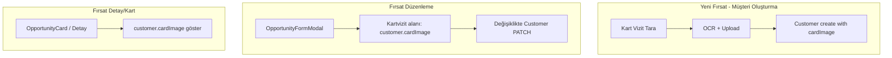

# Kartvizit OCR Özelliği — Geliştirme Planı

**Referans:** [docs/phase-3-features.md](../phase-3-features.md) — Branch 9 (F48, F49)

## Özet

Yeni Müşteri formuna "Kart Vizit Tara" butonu eklenerek, kullanıcının yüklediği kartvizit fotoğrafından Tesseract.js (ücretsiz, client-side OCR) ile firma adı, ad soyad, telefon ve e-posta bilgileri otomatik çıkarılacak. Kartvizit fotoğrafı müşteri ana verisinde (Customer) saklanacak ve Fırsat düzenleme/detay ekranlarında görünür ve düzenlenebilir olacak.

---

## Bölüm A: Kartvizit OCR (Önceki Plan)

### Mevcut Durum

- **Hedef bileşen:** [CustomerSelectInput.tsx](apps/web/src/components/opportunity/CustomerSelectInput.tsx)
- "+ Yeni Müşteri Ekle" tıklandığında açılan form: Firma Adı, Ad Soyad, Telefon, E-posta + İptal/Kaydet butonları

### Teknik Yaklaşım: Tesseract.js (Ücretsiz)

| Özellik | Değer |
|---------|-------|
| Lisans | Apache 2.0 (ücretsiz) |
| Çalışma yeri | Tarayıcı (client-side) — sunucu gerekmez |
| Türkçe desteği | `@tesseract.js-data/tur` paketi |
| İlk yükleme | ~2–4 saniye (worker + dil verisi) |
| OCR süresi | Görüntü boyutuna göre ~1–3 saniye |

### OCR Akışı

1. Kullanıcı "Kart Vizit Tara" butonuna tıklar
2. Dosya seçici açılır (accept="image/*")
3. Seçilen görüntü Tesseract ile işlenir (tur+eng)
4. Metin parse edilir → firma, ad, telefon, e-posta
5. Form alanları doldurulur
6. Görüntü upload edilir → URL alınır → Customer oluşturulurken cardImage olarak kaydedilir

---

## Bölüm B: cardImage Migration (Customer'a Taşıma)

### Mevcut Durum

- `cardImage` şu an **Opportunity** tablosunda
- Kartvizit müşteriye ait bilgi olduğu için **Customer** tablosunda olmalı

### Veritabanı Değişikliği

| Tablo | Aksiyon |
|-------|---------|
| Customer | `cardImage String?` ekle |
| Opportunity | `cardImage` kaldır |

**Migration stratejisi:** Mevcut Opportunity.cardImage değerleri ilgili Customer kayıtlarına kopyalanır (her customer için ilk bulunan opportunity.cardImage), ardından Opportunity'den kaldırılır.

### Backend Değişiklikleri

- **Customer:** create/update DTO ve service'e `cardImage` ekle
- **Opportunity:** create/update DTO ve service'ten `cardImage` kaldır
- **FairService** (fuar detay opportunity listesi): response'ta `customer.cardImage` kullan

### Shared Değişiklikleri

- **Customer** type/schema: `cardImage: string | null` ekle
- **Opportunity** type/schema: `cardImage` kaldır

### Frontend Değişiklikleri

- **OpportunityFormModal:** Kartvizit alanı `customer.cardImage` gösterir/düzenler
- **Kaydet:** Kartvizit değiştiyse önce Customer PATCH, sonra Opportunity create/update
- **OpportunityCard:** `opportunity.customer?.cardImage` kullanır
- **CustomerSelectInput (Kart Vizit Tara):** OCR + upload → Customer create with cardImage

---

## Bölüm C: Uygulama Sırası

### Adım 1: Shared + DB (cardImage migration)

1. `packages/shared`: Customer type/schema'a cardImage ekle, Opportunity'den kaldır
2. `apps/api/prisma`: Customer'a cardImage ekle, Opportunity'den kaldır, migration
3. Migration script: Opportunity.cardImage → Customer.cardImage (mevcut veri taşıma)

### Adım 2: Backend (cardImage migration)

1. CustomerService: create/update cardImage desteği
2. CustomerController: DTO güncellemesi
3. OpportunityService: cardImage kaldır
4. FairService: opportunity listesinde customer.cardImage kullan

### Adım 3: Frontend (cardImage migration)

1. OpportunityFormModal: customer.cardImage kullan, değişiklikte Customer PATCH
2. OpportunityCard: customer.cardImage kullan
3. use-customers: CreateCustomerDto cardImage
4. use-opportunities: CreateOpportunityDto'dan cardImage kaldır

### Adım 4: Shared (OCR parse utility)

1. `packages/shared/src/utils/parse-business-card.ts` — metinden firma, ad, telefon, e-posta çıkarma

### Adım 5: Frontend (OCR)

1. `tesseract.js`, `@tesseract.js-data/tur`, `@tesseract.js-data/eng` bağımlılıkları
2. `use-business-card-ocr.ts` hook
3. CustomerSelectInput: "Kart Vizit Tara" butonu, OCR + upload + form doldurma

---

## Dosya Özeti

| Aksiyon | Dosya |
|---------|-------|
| Yeni | `packages/shared/src/utils/parse-business-card.ts` |
| Yeni | `apps/web/src/hooks/use-business-card-ocr.ts` |
| Değişiklik | `packages/shared/src/types/customer.ts` (cardImage) |
| Değişiklik | `packages/shared/src/types/opportunity.ts` (cardImage kaldır) |
| Değişiklik | `packages/shared/src/schemas/customer.ts` (cardImage) |
| Değişiklik | `packages/shared/src/schemas/opportunity.ts` (cardImage kaldır) |
| Değişiklik | `apps/api/prisma/schema.prisma` |
| Değişiklik | `apps/api/src/modules/customer/customer.service.ts` |
| Değişiklik | `apps/api/src/modules/opportunity/opportunity.service.ts` |
| Değişiklik | `apps/api/src/modules/fair/fair.service.ts` |
| Değişiklik | `apps/web/src/components/opportunity/CustomerSelectInput.tsx` |
| Değişiklik | `apps/web/src/components/opportunity/OpportunityFormModal.tsx` |
| Değişiklik | `apps/web/src/components/opportunity/OpportunityCard.tsx` |
| Değişiklik | `apps/web/package.json` |
| Yeni | `apps/api/prisma/migrations/YYYYMMDD_card_image_to_customer/` |

---

## Kartvizit Görüntüleme ve Düzenleme Akışı

